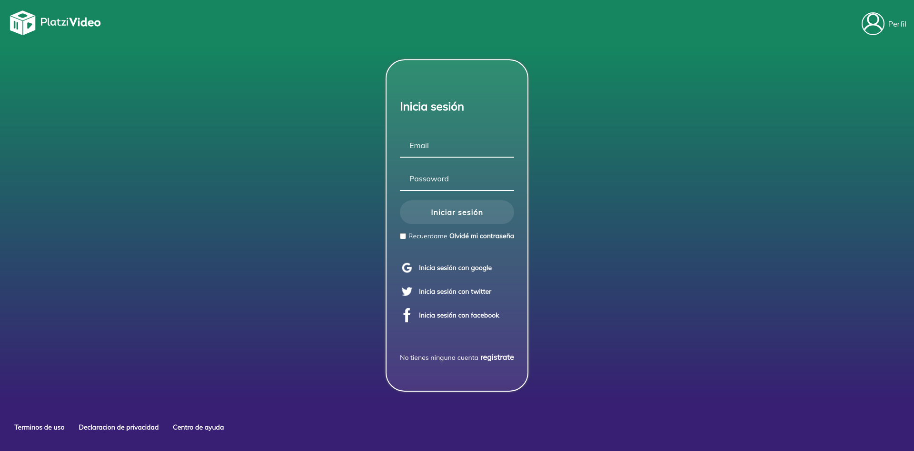

# PlatziVideo

> Final project of the javascript school



[Ver la aplicación](https://platzi-video3553.herokuapp.com/)

## Cómo funciona?

Requiere Node.JS 12

``` bash
# install dependencies
npm install

# serve with hot reload at localhost:9000
npm run start

# build for production with minification
npm run build
```
## Licencia 

MIT
